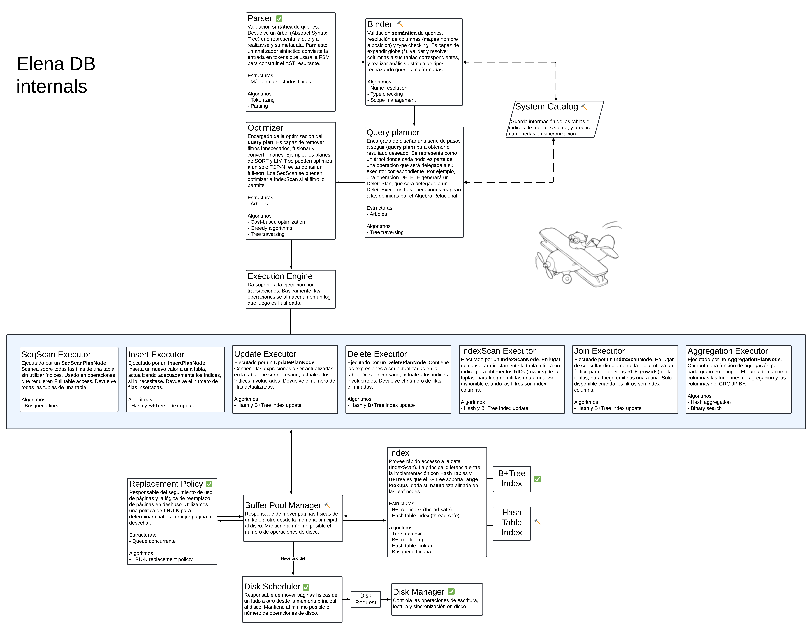

## 🚂 Try elena

```bash
go mod tidy
go run ./cmd/elenadb mydb.elena

elena>
```



<p align="center">
ElenaDB internal workflow (spanish)
</p>

## The modules

- The Elena CLI:

  See [docs/cli.md](./docs/cli.md) for the Elena CLI specification.

  ```bash
  go run ./cmd/elena mydb.elena
  ```

  The REPL communicates directly with the Execution Engine, starting
  from the parsing stage. Currently only parsing is supported.

- The Elena Query Language:

  See [docs/queries.md](./docs/queries.md) for the complete Language specification.

  - SQL-like syntax heavily inspired by the peruvian lexicon.
  - Easy to understand and know what's happening.
  - Compound queries were never so easy to read!

    ```elena
    let pedro = dame { id } de usuario donde (nombre=="pedro") pe

    mete {
        id_user: pedro.id,
        document_type: 'DNI',
        document_number: '72016572',
    } en doctor pe
    ```

- **Storage Engine**

  We'll build a disk-oriented storage manager for the Elena DBMS. The primary storage location of the database is on disk. The `BufferPool` in the storage manager allows the DBMS to handle databases larger than the available system memory by transparently managing page requests.

  **Key Components:**

  1. `LRU-K Replacement Policy`
  Objective: Track page usage and implement an eviction policy based on backward k-distance.
  2. `Disk Scheduler`
  Objective: Schedule read and write operations on the disk. Make sure it is thread-safe!
  3. `Buffer Pool Manager`
  Objective: Manage fetching and storing of database pages between disk and memory.

<!-- (!) Internal note: add your algorithms/data structures here -->

## Algorithms used

- [x] [LRU-K eviction policies](pkg/buffer/lru_k_replacer.go): A page replacement policy meant to solve the problems that LRU has,
  such as sequential flooding.
  <https://en.wikipedia.org/wiki/Page_replacement_algorithm#Variants_on_LRU>

- [x] [Disk scheduling](pkg/storage/disk/disk_scheduler.go): Used to optimize and prioritize disk accesss.
  <https://en.wikipedia.org/wiki/I/O_scheduling>

- [x] [Tree traversing](pkg/storage/index/another_bptree.go): BFS and DFS are used to traverse the B+Tree.
  <https://en.wikipedia.org/wiki/Tree_traversal>

## Data structures used

- [ ] Bloom filters. A probabilistic data structure to test whether an element is on a set.
  Used to implement fast Hash Table misses.
  <https://en.wikipedia.org/wiki/Bloom_filter>

- [X] Hash Tables:
      - [] Used in Hash Joins operations.
      - [X] Used in [Page Table, in Buffer Pool Manager](pkg/buffer/buffer_pool_manager.go).

- [x] [Concurrent queue](pkg/common/channel.go): Thread safe queue implementation.

- [x] [Finite State Machine (FSM)](/internal/query/fsm_steps.go)
