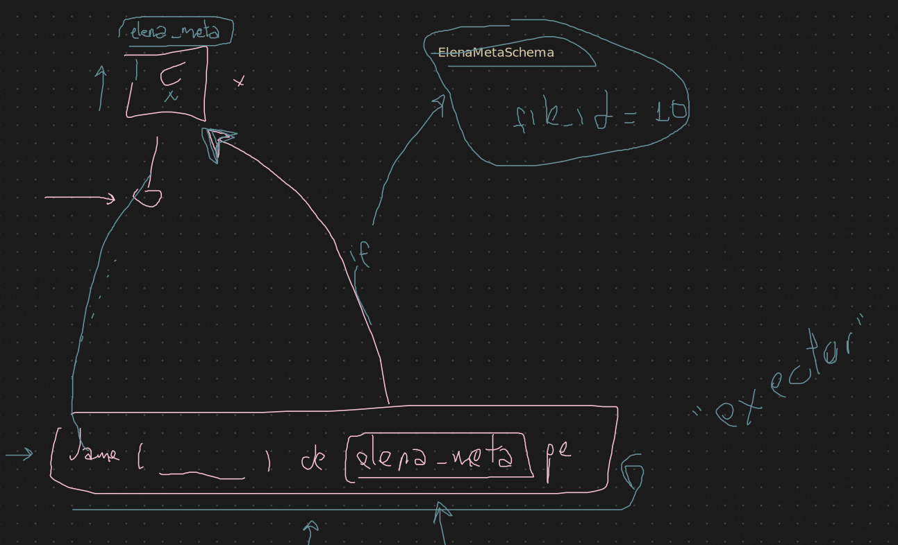

# Catalog
 
 after a long discussion
 we decided the following path:
 ElenaInstance -> turns on the DB and creates a -> Catalog filled with data (as params)
 The Catalog will be updated as long as data keeps being modified -> but in MEMORY
 the question is...
 when do we write the new data in disk?
 elena.RestInPeace() was proposed: when the DB is shut down, all changes will be written to disk. paolo mentions another approach: periodic writes?

 
